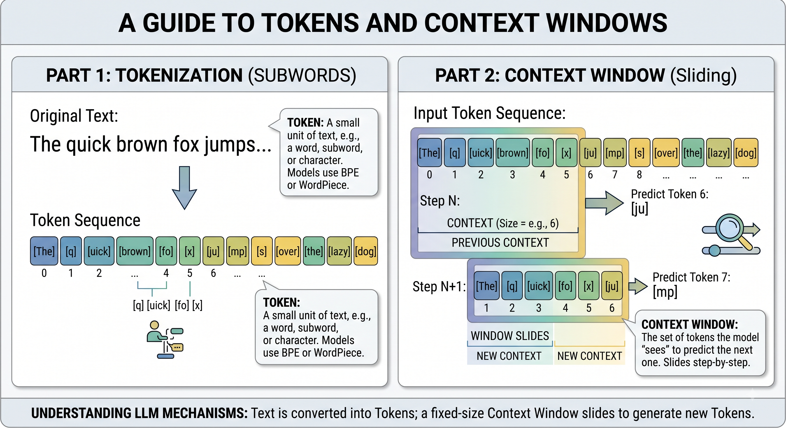

# Presentation to AKITA

# Artificial Intelligence Terms and Definitions

## Tokens

A token is the basic unit of text that an AI model processes and analyzes. Given the following sentence:

```
The quick brown fox jumps over the lazy dog. 
```

An AI model will see this sentence as a series of words or characters:

```
[The] [quick] [brown] [fox] [jumps] [over] [the] [lazy] [dog] [.] 
```

There are thus a total of 10 tokens for this sentence alone. Now imagine, the following paragraph:

```
Beautiful is better than ugly!

Explicit is better than implicit -

Simple is better than complex @


Complex is better than complicated.
Flat is better than nested.

Sparse is better than dense.

```
This paragraph has supposedly 35 tokens if you only consider the individual words and the individual punctuation or symbols. However, also consider that if the text has a context between what separates each sentences with one or two spaces, then we can count each space (usually encoded as `/n`) as a separate token. There are thus, an additional 6 tokens.

If we will let the model process one research paper, not only will it consider these factors, but also the following:

- Images and Figures (Most models today understand what each picture shows)
- Tables (parsed as a text with specific separators)
- Columns, which can disorient how it sees a paper
- Headings and footers can also waste tokens because it does not need to know these and yet, it reads it each page.

## Context Window

A basic understanding is found [here](https://www.datacamp.com/blog/context-window).

A model cannot store all it knows on its "brain". If you read a book with 900 pages, chances are you will only remember 100 pages at a time. As you add more pages, you forget the first few pages you just read.

Similarly, the **context window** for an AI is the amount of text it can hold in its working memory while it generates a response. Context windows affect various aspects, including the quality of reasoning, the depth of conversation, and the model's ability to personalize responses effectively. It also determines the maximum size of input it can process at once.

So if you ask the model "Give me reference papers, along with their abstracts", it can confidently pull even 100 titles, along with their abstracts depending on how many it can store at once. A 1 million context window means that it can store up to 1 million tokens at a time before responding. 

But if you ask it to remember the full text of a single paper, it may struggle to do so due to the large amount of text it needs to remember at once. That does not include what you need to ask the model regarding the full paper.



## RAG 

A basic understanding is that AI models, by default, only know what they were originally trained on. If you ask an AI about an highly specific internal document or a news event that happened yesterday, it might not know the answer because that information was never stored in its "brain."

Imagine taking a difficult history exam. Generating an answer purely from memory is how a standard AI model works. However, **RAG** is like taking an *open-book* exam.

When you ask a question using a system with RAG, the AI first becomes a researcher:

1. It searches an external database (like your company's documents, a specific set of PDFs, or the live internet) to find information relevant to your prompt.

2. It retrieves the most useful snippets of text.

3. It reads those snippets and augments its response, using those facts to generate an accurate answer.

If we let the model process a huge folder of research papers using RAG, it does not need to fit the entire scopus into its context window at once. Instead, it will only retrieve the specific paragraphs that answer your immediate question, saving tokens and significantly reducing the chance of it making things up.

## Parameters

Imagine a giant soundboard in a recording studio with billions of tiny sliders. When you feed the model a sentence like:

```
The quick brown fox jumps over the lazy ___
```

You are expecting the model to predict the word "dog". In order to do so, the model has to pass this through its vast number of sliders. These sliders are known as parameters.
When you hear about a model having "8 billion parameters" or "1.5 trillion parameters," it refers to the sheer number of these adjustable connections. More parameters generally mean:

- Better reasoning capabilities and nuance
- A deeper understanding of complex topics and multiple languages
- A larger memory footprint, requiring more powerful computer hardware to run

But at the cost that a larger model is heavier and more expensive. This is the main justification in purchasing GPUs to handle models. In choosing a GPU, one needs to prioritize if the model fits its **Virtual RAM**.

## Video RAM (vRAM)

A GPU's virtual memory is also referred to the size of its vRAM. When you put the model in your server/computer, you are putting all of its parameters inside your GPU's vRAM. The reason is because by utilizing all this memory, it can generate text quickly.

Imagine your physical RAM as the surface of a desk. If you have a small desk (e.g., 8GB of RAM) but you are trying to open a massive encyclopedia (a large AI model), the book simply won't fit on the desk. 

