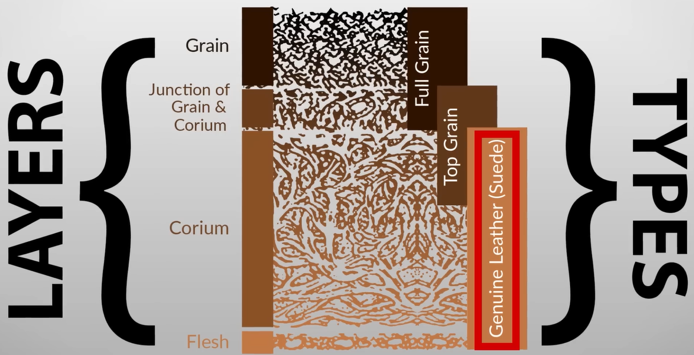
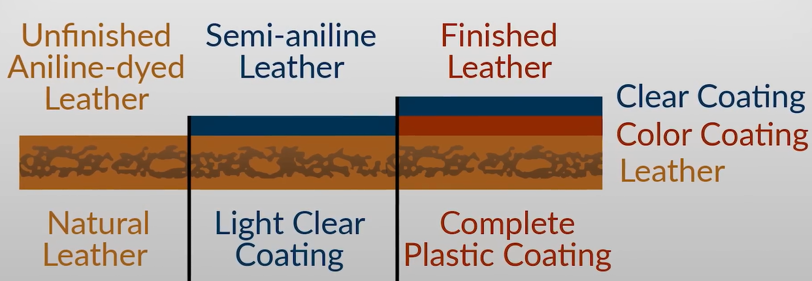
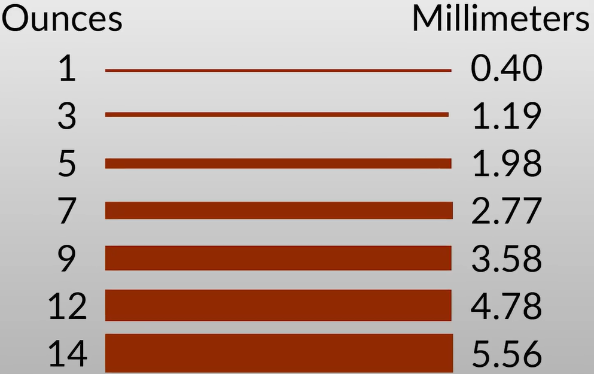

# All About Leather
- https://www.youtube.com/watch?v=HiKxzo1PAZM
- https://www.youtube.com/watch?v=6kKiQ-nUp5A
- 

# Leather Types
## Full-grain
- Harder to work with = more expensive (labor costs)
- Rugged and durability 
## Top-grain
- Smoother
- Thinner and pliable = easier to work with
- Wallets, card holders, belts, etc.
## Suede
- Fuzzy finish bcause the animal skin is used to make it
- Priced for its velvety smooth texture
- Less expensive compared to genuine leather, but also less durable
- Needs to be brushed and cleaned regularly
- Best for clothes, shoes, and accessories.

## Summary

# Leather Finishing

- They add a thick plastic coating to protect the leather from heat and rain. 

# Leather Thickness

- Past 6 ounces, it becomes less malleable. It is hard to shape.

# Current Leather collection
## Shoes
- **Black shoes**: Top-grain leather
- **Work loafers**: Top-grain leather
- **Sneakers (Addidas)**: Accents of suede leather 