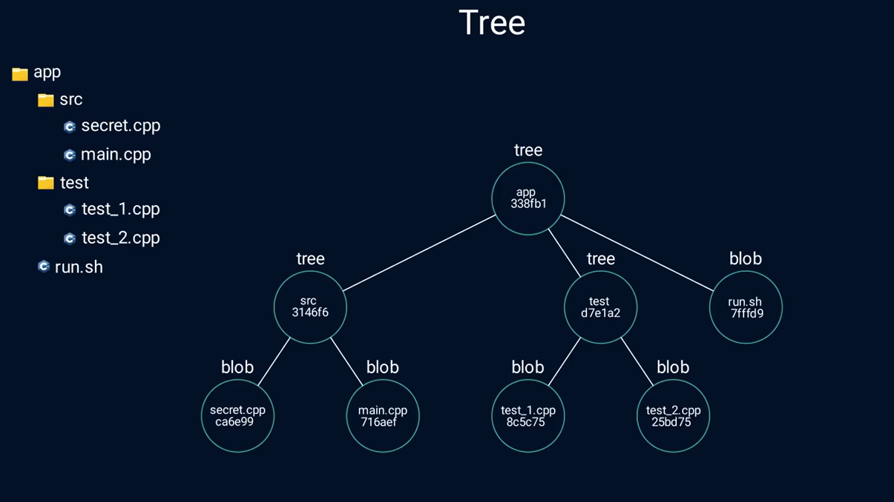

# What is Git

## How Git looks at changes


- Git thinks of its data more like a series of snapshots of a mini filesystem.
- Everytime you commit or save the state of your project, Git basically takes a picture of what all your files look lite at that moment and stores a reference to that snapshot.
- Git doesn't store the file again if there are no changes to the files, just a link to the previous identical file it has already stored.

In the end, Git is a key-value store with every content (line changes, functions, etc.) stored as a value (object) and referenced by a key, which is generated via a **SHA1** algorithm of the value. To save space, it also compresses the values via**zlib**.

## Nearly Every Operation is Local

Most operations in Git need only local files and resources to operate. The `.git` directory has the following sub directories inside:

```
COMMIT_EDITMSG  branches     hooks  logs         refs
HEAD            config       index  objects
ORIG_HEAD       description  info   packed-refs
```
All your code changes (diffs) are stored via different snapshots, which can be identified by each commit's key (hash).

## Git Has Integrity

Everything is [checksummed](https://en.wikipedia.org/wiki/Checksum) (Bitwise exclusive OR) before it is stored and is then referred to that checksum. It is then impossible to modify the contents of any file without Git knowing about it. You can't lose any data in transit or get file corruption without Git being able to detect it.

Inside `objects` is the following:

```
11  12  64  7c  aa  bd  d3  d8  ee  f4  f6  fd  info  pack
```

Each of these directories correspond to a hash file inside:

```
11: cff3b1452514401a3c02d608215d172ffc89bb
12: 6470b85d1972b6bea82220a654b7f0a1003281
64: 951ecc42a6dad9d80349df9dfe53b240abf11f
7c: f3ac96dfaee3d82e41239f218909d831487337
aa: 9d28ecc647d0487e7a3bda439cc0a80c446287
bd: ddbe799a83f3955ca2e818dc550738888e336c
d3: 2a44edbd0a13c573276f100f71c43e91f8f5dd
d8: 2d8f40e98095e2e1be5e4ca60e03f788f804e6
ee: 81dd8331209097419064ca20d462054e5d9d8c
f4: 5525839266fcc0a74183e1f097136ca548ec88
f6: cfa2668c00d67336fccbfb3c2f9015f8ed82f9
fd: 4017f85985705b569d9b3bad86e594aa9eae7a
info:
pack: pack-059b966630d5725a8a4503a3b0fb180f5318e791.idx
pack-059b966630d5725a8a4503a3b0fb180f5318e791.pack
pack-059b966630d5725a8a4503a3b0fb180f5318e791.rev
```

The first hash is the **Directory** name. The second hash is the **File** name. To visualize the content of each commit, we can use the following commands: 
```bash
git hash-object [filename] -w  // Writes the hash of the said file
git cat-file blob [hash_directoryfilename] // Reads the content of the hash, which outputs the contents of the file
```

So for example, the file `hello.txt` when commited has the hash 24313432sd. Then we can see what is inside it with:
```bash
git cat-file 24313432d  
```

Since Git can be visualized as a database, every stored data is represented as a **[blob](https://developer.mozilla.org/en-US/docs/Web/API/Blob)**, which is an immutable data type that does not store any metadata such as filename and can be read as text or as binary data.

# The Three States and Main Sections of a Project

## The Three States

- **Modified** - You have changed the file but have not commited into the database yet.
- **Staged** - You have marked a modified file in its current version to go into your next commit snapshot.
- **Commited** - Data is safely stored in your local database.

## The Three Main Sections


- **Working tree** is a single checkout of one version of the project. These files are pulled out of the compressed database in the Git directory and placed on the disk for you to use or modify.
- **Staging area** or *index* is a file, generally contained in your Git directory, that stores info about what will go into your next commit.
- **Git directory** is where git stores the metadata and object database for your project. It is what is copied when you `git clone` a repository from a remote host.

The workflow is then:

1. You modify files in your working tree.
2. You selectively stage just those changes you want to be part of your next commit, which adds only those changes to the staging area.
3. You do a commit, which takes the files as they are in the staging area and stores that snapshot permanently to your Git directory.

# Git Trees



A tree can be a nested collection of blobs and other trees. It solves the problem of not having a filename assosciated with a blob. Think of it as a directory with files (blobs) and subdirectories (trees).

To visualize this concept, consider a commit with hash `aa9d28`. Use the following command to list what files and directories are inside that commit:

```bash
git ls-tree [hash]
```

which works out to:

```
040000 tree 21a3f8d4764b85b03d21c435de2e1b4c7a54753d    .vscode
040000 tree e538c335c4df0ad16a3204d31e3fd8c24552e1da    AI_Engineer
040000 tree 645eefb52c6d08758f9aa5688726a5acdeb02db7    Amazon_Web_services_Notes
040000 tree f8a1b86a1dd6c1d665fd19e11b11870ed935cfb1    Associate_Data_Scientist
100644 blob 8abf1464ada495ec8e3251eaec2c32336a910e7a    Blockchain.ipynb
040000 tree ddeed03c02e16cb8bbf074ab6dc6a44c7420b76c    Data Visualization
040000 tree 2027709bcace398d6931c7fa702c55b406eb5413    Data_Engineering
040000 tree 7e9e2fe45017bce752516b3b0723753ba5653a79    Datasets
040000 tree f173b90e8d5bc4260ddf462b1c75ee07e7ff725f    Fashion
040000 tree 126470b85d1972b6bea82220a654b7f0a1003281    FinTech
040000 tree b888f1a5f685b838f63020698ec68817eb643f70    Financial_notes
100644 blob 9928c492926310d00765a1d28b7880ab36db9258    Pipfile
100644 blob f61559dac0f84617db2898d2f87536e5dcb59e35    Pipfile.lock
160000 commit 512ce7826ed0c51830760a95b618786f242b2744  Project_1-Detecting_Fake_News
100755 blob 9285d4295e2f2e86a8644bea4a5e35dbb15234ab    Python-Collections.md
040000 tree 57a0702848e870ce44119eb65909ac79734cd368    Short_projects
040000 tree 566f3117d253e7a7d964121ba5dd22b4fade2507    Software_engineering_notes
100755 blob ab894e5a6f7970557517a16c11656314d5b5c73c    main.ipynb
```
You can use the same command to look into each `tree` type in the second column to list the blobs and other trees within said tree.

# First Time Setup For Git

You initialize a git repository within the project using `git init` command. See the version of git with `git --version`.

The `git config` command lets you get and set comnfiguration variables to control all aspects of how Git looks and operates. These variables can be stored in three different places:

1. `[path]/etc/gitconfig` file: Contains values applied to every user on the system and all their repositories. If you pass the option `--system` to `git config`, it reads and writes from this file specifically. Because this is a system configuration file, you would need administrative or superuser privilege to make changes to it.

2. `~/.gitconfig` or `~/.config/git/config` file: Values specific personally to you, the user. You can make Git read and write to this file specifically by passing the `--global` option, and this affects all of the repositories you work with on your system.

3. `config` file in the Git directory (that is, `.git/config`) of whatever repository you’re currently using: Specific to that single repository. You can force Git to read from and write to this file with the `--local option`, but that is in fact the default. Unsurprisingly, you need to be located somewhere in a Git repository for this option to work properly.

You can view all your settings and where they are coming form using:

```bash
git config --list --show-origin
```

## Your Identity

```bash
git config --global user.name "[YOUR_NAME]"
git config --global user.email "[YOUR_EMAIL]" 
```

### Your Remote Identity via SSH 

Nowadays, modern version control (Gitlab, GitHub) uses SSH keys to verify identity for repos. Here's a step-by-step into the process:

1. Run the command to create an SSH keypair (private and public)
```bash
sssh-keygen -t ed25519 -C "your_email"
```

2. Add the Key to You Local SSH Agent. Start the SSH agent in the background and registrer your new private key:
```bash
eval "$(ssh-agent -s)"
ssh-add ~/.ssh/id_ed25519
```

3. Copy the public key stored in `ssh/id_ed25519.pub`

4. Link the Public Key to Your Git Provider. naviagte to `Settings > SSH and GPG Keys > New SSH Key`. Give it a title and paste the public key into the text field, then Add SSH Key.

5. Verify Connection via the `ssh` command:
```bash
ssh -T git@github.com
```
6. Update your Local Repository to Use SSH. Say that your remote repo is `https://username/repo`. Reset this via:

```bash
git remote add origin git@github.com:username/repo.git  //first time
git remote set-url origin git@github.com:username/repo.git  // change current
```

## Check your Settings

Run `git config --list` to list all setting Git can find in your config.i

## Your Default Branch Name

Set the default branch name to *main* for example as:

```bash
git config --global init.defaultBranch main
```


