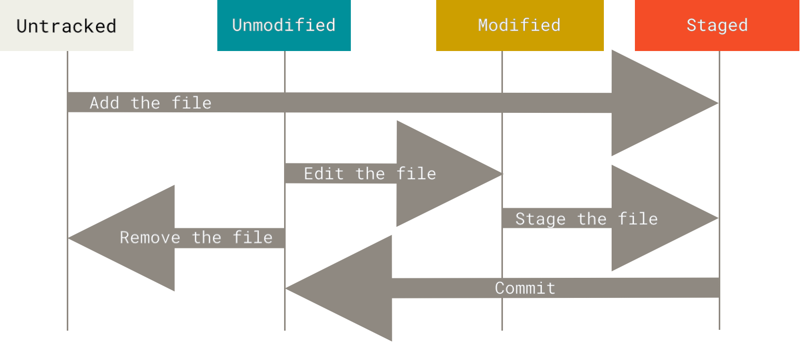

# Basics of Git

## Getting a Git Repository
```bash
git clone [url] [name_in_local]
```

## Recording Changes in a Repository

Each file in a directory can be in either state: *tracked* or *untracked*. Tracked files include the rest of the code that will be modified, staged, and committed. Untracked files are those that are not yet added to the index (staging env). Files like these do exist (i.e. secrets in TOML, env files, etc.).



To check the status of your files, simply do `git status`. It will result in a sample like below:
```
On branch main
Your branch is up to date with 'origin/main'.

Changes not staged for commit:
  (use "git add/rm <file>..." to update what will be committed)
  (use "git restore <file>..." to discard changes in working directory)
        deleted:    Software_engineering_notes/Git_Gud.ipynb

Untracked files:
  (use "git add <file>..." to include in what will be committed)
        Software_engineering_notes/Git/

no changes added to commit (use "git add" and/or "git commit -a")
```

## Viewing your Staged and Unstaged Changes

The `git diff` shows an even more detailed command of what the changes occured between commits, working trees, and the project itself. Some quick info are:
- No args will show what changed but not yet staged.
- `--staged` shows what you've staged that will go into your next commit.
- `--cached` are synonymous with `--staged` 

# Commits

Aside from blobs and trees, the third type of object is a **commit**. It is a snapshot of your project at a point in time, reflecting what you added in the *index* (or the staging area). A commit can store the following:
- A message describing the change
- Info abou the author (name, email, etc.)
- The current working tree
- Pointers to previous commit to trace back (via `revert`).

For an initial commit, there are zero parents. Any normal commit now has one parent commit. For a commit that is a result of multiple branches (via `git merge` or `git rebase`), there will be multiple parents as seen below:

```bash
git show --format="Commit: %H%nParents: %P%nAuthor: %an <%ae>%nDate:   %ad%n%nMessage:%n%B" --no-patch <commit-id>
```
Output:
```
Commit: 4a9908a4eeeb0251cf9f6849152f0b308bad28c5
Parents: 66dba7709171a5d0b8823f74b840df3b9a9d7129 6b9b00c30b77c37bfc443e9d039bf804cfada5e0
Author: ToniYenC11 <tonicastanares11@gmail.com>
Date:   Wed Jul 22 15:54:42 2026 +0800

Message:
Merge branch 'main' of 192.168.98.180:toni/CervAI-Plus
```

## Viewing Commits History

```bash
git log 
```
Some arguments:
- `-p` or `--patch` shows the diff in each commit.
- `-[int]` limits to show only the last `[int]` entries
- `stats` shows abbreviated stats
```
commit aa9d28ecc647d0487e7a3bda439cc0a80c446287
Author: ToniYenC11 <tonicastanares11@gmail.com>
Date:   Wed Jun 24 15:14:00 2026 +0800

    FinTech Assessment question 6-10 currently being answered

 FinTech/FinTech_Assessment.md | 100 ++++++++++++++++++++++++++++++++++++++++++++++++++++++++++++++++++++++++++++++++++++++++++++++++++++
```
- `pretty` changes the log outputs to formats other than the default. For example, `oneline`, `short`, `full`, `fuller`. The `--oneline` is a shortcut version of `--pretty=oneline`
    - For a list of useful specifiers, see [the pretty format](https://git-scm.com/book/en/v2/ch00/pretty_format) documentation.
- For a list of more options to git log, see [the official docs](https://git-scm.com/book/en/v2/ch00/log_options) of said args. See also the [limit options](https://git-scm.com/book/en/v2/ch00/limit_options).

## Undoing Things

The following command ammends the last commit:
```bash
git commit --amend
```

and you can add a current changed file then invoke the command to include it in the previous commit:
```bash
git commit -m "created file"  # Assume commit created with hash 123456
git add .  # This adds ammendments to the file
git commit --amend # Opens nano for editing message, then commit is still 123456
```

To restore current commit to a previous:
```bash
git reset HEAD~[int] 
```
The [int] is the number of commits from the current that you wish to restore. So if you want to restore to the previous commit, set `n=1`. Hence, `git reset HEAD~1`.

To remove the file from staging environment (STAGED -> MODIFIED):
```bash
git restore --staged <file> # From git advisory
```

To discard changes in working directory (Remove them from Modified state):
```bash
git restore <file>
```

# Working With Remotes

`git remote` shows your current remote repo as its shortname. Supply `-v` to show the URL for both fetch and push.

To add a remote: `git remote add <shortname> <url>`
To import the data to your local repository WITHOUT merging: `git fetch <shortname> <branch>`
To import the data to your local repository AND merge the remote branch to your current branch: `git pull <shortname> <branch>`

To configure how Git will merge your code, the following are options (more on branches later):
```bash
git config --global pull.rebase false # Merges branch history
git config --global pull.rebase true # Rebase: Converts history into linear
```

To put your changes into the remote branch: `git push <shortname> <branch>`

## Renaming and Removing Remotes
```bash
git remote rename <old_name> <new_name> # Renames shortname
git remote remove <shortname> # Remove remote
```

# Tagging

Use this feature to tag an important commit with either version number or specific notes.

There are two types of tags:
1. **Lightweight** - A pointer to a specific commit 
2. **Annotated** - Stored as full object in git (`.git/objects`)

## Commands Around Tags

Creating annotated tags: `git tag -a <name_of_tag> -m <tag_message>`
Listing tags: `git tag`
Listing tags with a specific pattern: `git tag -l <pattern>`
Deleting tags: `git tag -d <name_of_tag>`
View versions of a tag: `git checkout <name_of_tag>`

You can also addd a tag to a commit: `git tag -a <name_of_tag> <COMMIT>`

# Aliases

Rename some of your commands using: `git config --global alias.<alias_name> <command>` 

# Branches

Commits are however, identified by hash values, and are not human-readable. Hence, a **branch**, which references a series of snapshots (commits). They are *mutable* because each commit is *immutable*.
